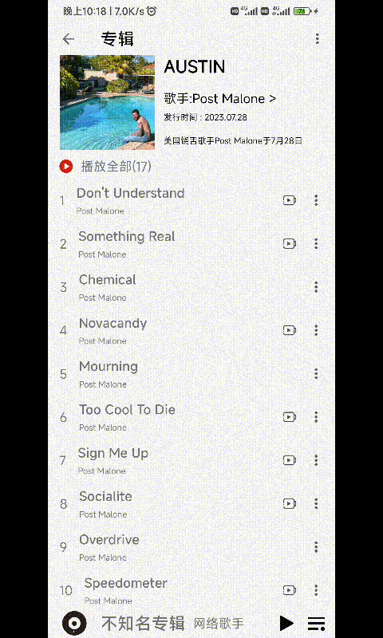
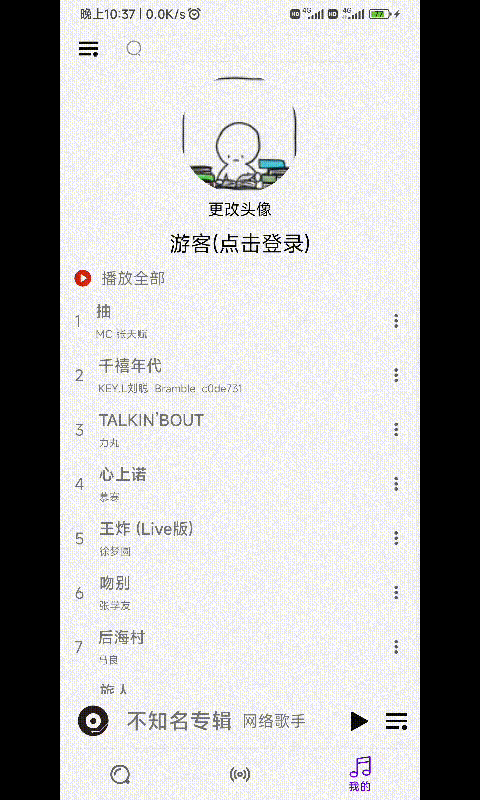
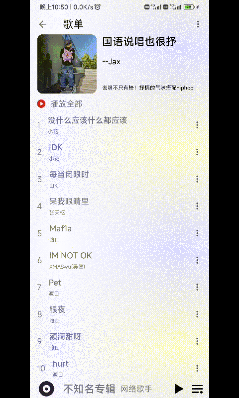

# readme

## 概览 

这次负责的是六大模块：

app模块：主界面的搭建

find模块：也就是网易云首页模块

mine模块：我的模块

lib_util：工具类模块

lib_search：搜索模块

lib_mv：mv模块

## 技术栈

采用MVVM架构

BottomNavigation+vp+fragment主界面搭建

paging3 + flow加载

retrofit + flow(stateflow),网络请求

Coroutine:非阻塞式代码

retrofit  + rxjava + livedata网络请求

简单的自定义view

room + flow

seekbar + rv：同步进度

简单的属性动画

视频播放第三方库dk

差分刷新adapter

bottomsheetfragment：分享

searchView：搜索

简单使用arouter

## 详细介绍

### app模块

app模块定义了app的雏形，有上面的搜索框，侧边栏(侧边栏里面就做了个本地图片上传)

上面搜索点击会跳转到搜索模块

中间和下面整个界面采用bottomNavigation+vp+fragment

三个fragment分别对应三个模块，find，podcast，mine。

从上到下来介绍一下

### search

最上面是搜索模块

点进去就会跳转到searchactivity

正如所看到的，最上面使用了一个searchView，用来提供搜索联想和提交功能。

下面是一个简单的**自定义view**，也就是流式布局。虽然很简单，但是写的头都大了。自定义view不如选入高等数学教材(不是)。

下面主要介绍一下写这个搜索框的时候的艰难历程(内存泄漏历程，当然现在没有了)：

最开始设置的时候，能够正常显示，但是一打日志发现，fragmentManager中有还有许多fragment。所以我就想着全局一个实例，当然就爆了，说viewmodel一些的问题，于是我才用了更加暴力的方法，也就是每次添加的时候把fragmentmanager中所有的fragment删除掉，然后再新增要显示的，这样就减少了同一时刻内存中存在的fragment的数量，但是每次打日志就会发现fragment还是很多，于是我就优化，优化成搜索联想判断当前是不是搜索联想的fragment的界面(这也有坑getFragment突然就消失了，之后改用findFragmentById，参数是fragmentcontainerview的id)，如果是，只修改fragment中的数据(别问我为啥之前不搞，原因是因为fragment重叠的原因不显示)，如果不是就replace进去，到此，搜索联想优化到此结束。

搜索提交还有一段故事：searchview默认会提交多次，不管返回值是true还是false，网上的都是暴力清空，但是暴力清空之后导致搜索联想界面被触发，虽然之后设置为不可见了，但是再次搜索还是会有问题。于是我加了一个状态位，问题解决。

对了，值得一提的是，在搜索结果页面这里面我还有用到paging+flow，所以应该是滑不到底的，这里不过多介绍了。

### find

首页是有缓存的，也就是没网也能看，但是也只是看看，技术支持是sp+gson，展示的话看工具类那边。

如上面看到的，从上往下一个个分析，首先是轮播图

#### banner

无限实现方法：获取数据之后在adapter中将viewpager的页面无限延展(%)，同时在设置当前页面为最大值的一半，这样估么着一辈子也滑不到头。

轮播实现方法：采用handler的postDelay方法。

需要注意的是，由于数据刷新，会导致banner的轮播会很奇怪，这里在开启新的handler之前先把旧的移除掉就可以了，同时也考虑到了不可见的时候也会停止滑动

指示器：简单的自定义view，真的很简单，手搓一会就出来了，可能又搓过搜索历史的经验了，就是数学!在设置轮播图当前item的时候也设置一下它，同时注意，索引还是无限大，取余数就可以了。

切换动画：其实不是动画，是一个转换效果，自己继承viewpager2的pagetransformer写就完了，设置了放缩和透明。小学数学！下面的排行榜也是使用了这个，不再赘述了。

点击事件：设置了三种，一种是普通歌曲，一种是专辑，一种是活动

#### rv+seekbar

刚看到网易云的下面的时候我是懵的，后来才了解到有这样一个view控件，还是很好用的。给rv设置滚动监听，滚动监听的时候设置seekbar的进度，同时我额外增加了拖动seekbar之后rv也会滑动，实现也很简单，设置一个进度监听。是来自用户的，然后按比例设置rv进度就可以了。是百分比增加的哦。

这期间了解到rv的两个属性，computeHorizontalScrollRange也就是rv多长，computeHorizontalScrollOffset也就是rv滑动的距离。

#### 共享元素动画

给需要共享的控件加一个transitionname，然后就是跳转的时候加几行代码，简单的使用了一下。

#### CoordinateLayout

协调者布局，从零开始，最开始我是一点都不会的。受折磨了一天。

实现了协调者样式，也就是很好看的一个效果，其中说说一个实现非常简单的但是却折磨我很久的东西：实现到顶部悬停的效果。

先说结论，就是AppBarLayout相当于一个linearlayout，在其中放CollapsingToolbarLayout，CollapsingToolbarLayout中的会被折叠，但是在AppBarLayout里面，CollapsingToolbarLayout外面的就会随着滚动直到最上面，同时悬停。

还要注意的是这里还有坑，nestscrollview会一次性渲染所有内容，所以不能配合paging使用，要不然你就会看到源源不断的网络请求。会卡到爆炸的！！！

### mine

#### 本地头像上传

存储到本地是通过sp做到的，主要说一说读取本地图片。

权限请求是一方面，从相册获取照片使用registerForActivityResult，然后传入参数ActivityResultContracts.PickVisualMedia()，这是一个协定，用来从相册中挑选照片的，然后launch启动，传入请求参数，这里详细的我也不太清楚，就是选择一张照片然后返回。

#### 最近播放

room + flow + paging

room是可以配合flow，类似于网络请求，只需在数据访问接口前面加上suspend就行了，同时因为这里还配合了paging，在pagingsource中获取数据库数据，然后加载到mine，也就是最近播放页面。

#### 网络请求

mine模块中的网络请求是rxjava + livedata

### mv

使用了第三方库dk，同时使用paging加载推荐视频

### util

借鉴了很多玩安卓的工具类，同时自己也封装了一些工具类

- 将对象转换成为gson通过sp存储和取出对象的封装

- 调用系统分享操作的封装

- 差分刷新工具的封装

- 动画-旋转的封装

依次展示一下，首先是断网处理：

然后是调用系统分享:

然后是旋转动画工具的封装(不会有动画的中断感觉) :

## 感悟

学到了很多东西(忘了很多东西)

关于协程

这次项目中，我只有在我的界面中使用了rxjava+livedata(体现一下技术栈)，其它地方全部用stateflow平替掉了。不得不说，学到的知识还是有用的。rxjava给了我们充分的处理，只需要重写对应的方法就可以达到效果，但是不够简洁，很多。flow给了我们简单网络请求更加简单的操作。但是，简单就有坏处，flow想要更完备就需要处理更多东西，比如说断网的时候，rxjava中一般我们都会重写onError方法，但是flow中不一样，flow需要我们有意识的去处理。例如使用catch，或者在协程作用域的上下文中传入异常处理对象，等等。在写的时候我还是更多时候使用了协程作用域的异常处理。

关于多人开发

说实话，多人开发是真的难，这次项目关于音乐对接就对接了三天多，还有各种其它的对接，因为想法的不一致导致问题频出，但是还好最后都解决了。很感谢和我并肩作战的队友，没有约束我很多，也有很积极的在做，这里吐槽一下不回消息。

关于面临新事物

说实话，这个项目中我学到了很多很多东西。协调者布局是现学的，seekbar是现学的，searchview是现学的，mv是我昨天做的，当时我找来找去，发现都很困难，最后静下心来发现不过如此，于是mv界面就诞生了。

关于美观

说实话，这个项目中学到了很多美观上的东西，屏幕边距，圆角，阴影，边框，还有很多materialdesign的东西，学到的真的太多了。

关于内存泄漏

这个app正常使用是没有内存泄漏的，说实话，解决了不少的内存泄漏，有service没有取消绑定的，有动画没有取消的，有handler切换页面没有移除的等等等，反正是都解决了，希望不要再有奇奇怪怪的内存泄漏把。

## 不足

说实话，不足有很多很多。

没有很恨炫酷的动画，项目中仅仅封装了一个旋转的动画和一个共享元素动画。

没有难的自定义view，项目中仅仅实现了两个简单的自定义view。

没有沉下心多封装几个工具类，重复代码有点多。

对fragment的理解不到位，导致写这个的时候问题频出，虽然最后都解决了，但是很浪费时间。

对事件分发的理解不到位，没有处理好滑动冲突，最后被迫放弃下拉刷新。

没有好好整理一下代码，说实话写的有点丑陋。

